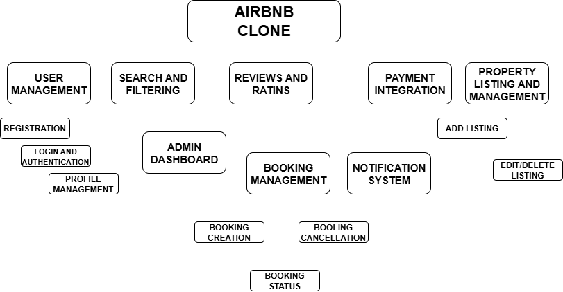

## Table of Contents

- [Core Features](#core-features)
  - [1. User Management](#1-user-management)
  - [2. Property Listings Management](#2-property-listings-management)
  - [3. Search and Filtering](#3-search-and-filtering)
  - [4. Booking Management](#4-booking-management)
  - [5. Payment Integration](#5-payment-integration)
  - [6. Reviews and Ratings](#6-reviews-and-ratings)
  - [7. Notifications System](#7-notifications-system)
  - [8. Admin Dashboard](#8-admin-dashboard)

# Core Features

The backend for the Airbnb Clone must enable key features that align with the functionalities of a rental marketplace.

## 1. User Management

**User Registration:** Allow users to sign up as guests or hosts. Use secure authentication methods like JWT (JSON Web Tokens).

**User Login and Authentication:** Implement login via email and password. Include OAuth options (e.g., Google, Facebook).

**Profile Management:** Enable users to update their profiles, including profile photos, contact info, and preferences.

## 2. Property Listings Management

**Add Listings:** Hosts can create property listings by providing details such as title, description, location, price, amenities, and availability.

**Edit/Delete Listings:** Hosts can update or remove their property listings.

## 3. Search and Filtering

Implement search functionality to allow users to find properties by:
- Location
- Price range
- Number of guests
- Amenities (e.g., Wi-Fi, pool, pet-friendly)

Include pagination for large datasets.

## 4. Booking Management

**Booking Creation:** Guests can book a property for specified dates. Prevent double bookings using date validation.

**Booking Cancellation:** Allow guests or hosts to cancel bookings based on the cancellation policy.

**Booking Status:** Track booking statuses such as pending, confirmed, canceled, or completed.

## 5. Payment Integration

Implement secure payment gateways (e.g., Stripe, PayPal) to handle:
- Upfront payments by guests.
- Automatic payouts to hosts after a booking is completed.

Include support for multiple currencies.

## 6. Reviews and Ratings

- Guests can leave reviews and ratings for properties.
- Hosts can respond to reviews.
- Ensure reviews are linked to specific bookings to prevent abuse.

## 7. Notifications System

Implement email and in-app notifications for:
- Booking confirmations
- Cancellations
- Payment updates

## 8. Admin Dashboard

Create an admin interface for monitoring and managing:
- Users
- Listings
- Bookings
- Payments

Detailed Diagram Below
